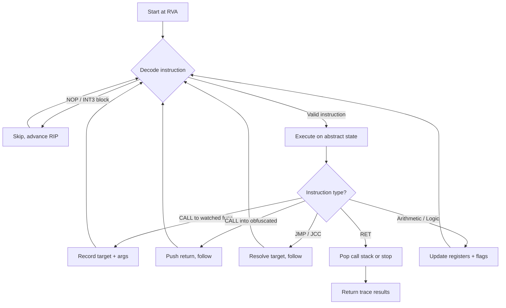
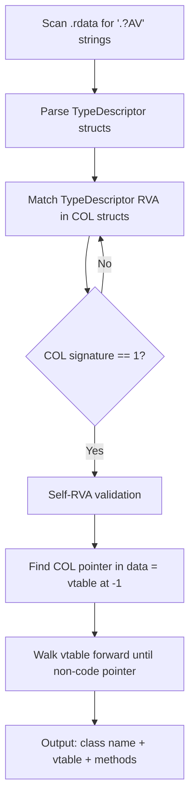
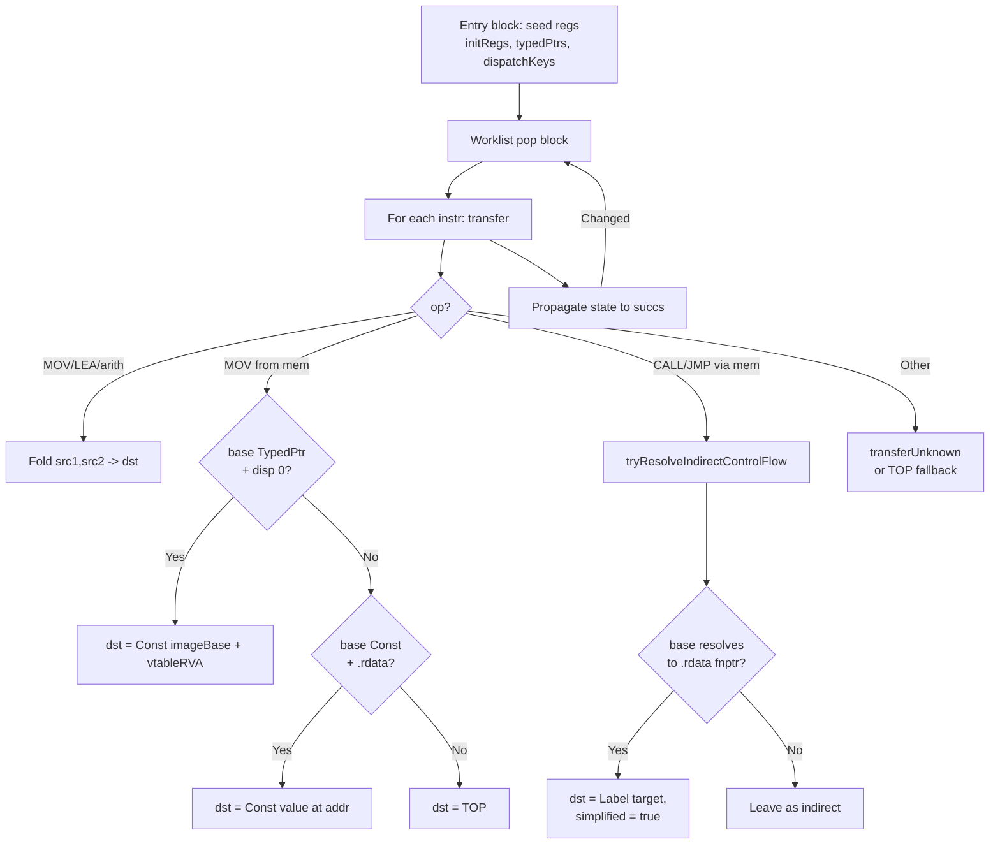
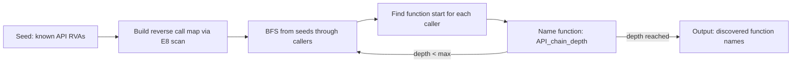

# Algorithms

## Static tracer

## RTTI recovery

## Constant propagation

`pefix::ConstProp` runs a worklist-driven dataflow over `Func.blocks`. Each register
holds one of {TOP, CONST, TYPED_PTR, BOTTOM}. The engine folds standard x86 arithmetic
when both inputs are concrete, and ships an extension hook (`transferUnknown`) for
non-x86 opcodes (libgriffin's `MBA_*` ops override this).

Downstream tools devirtualize vtable calls by seeding a register with TypedPtr and
running the engine: `mov rax,[rcx]` resolves to Const(vtable VA), then `call [rax+N]`
reads the slot and gets its dst rewritten to a direct LABEL. The dataflow drives this
without any byte-pattern matching, so it covers `(dst,base)` register pairs the older
pattern-based resolver missed.

## Import chain BFS

