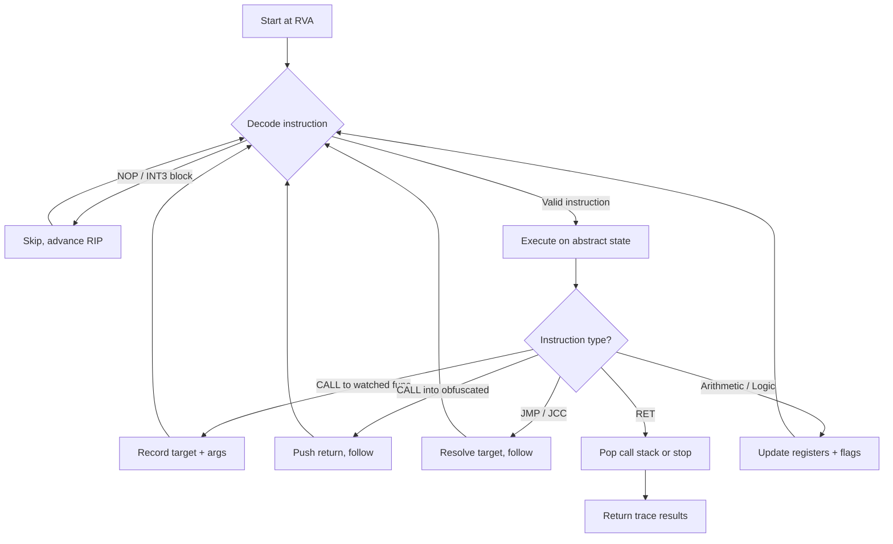
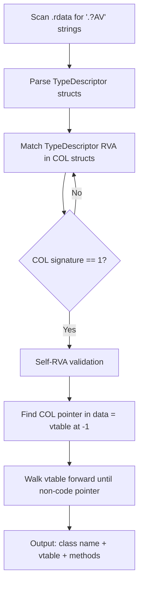
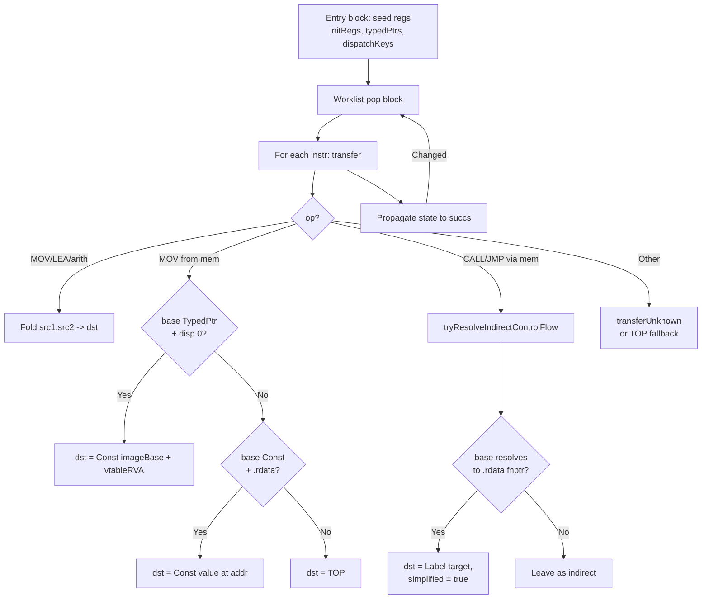
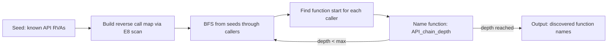
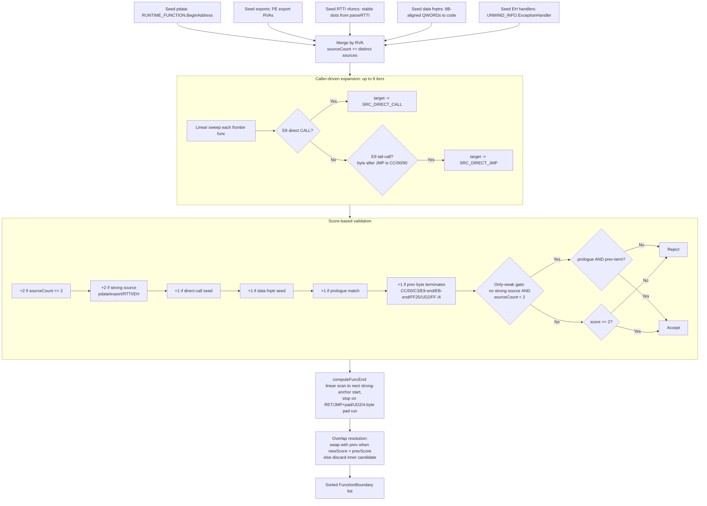

# Algorithms

## Static tracer

## RTTI recovery

## Constant propagation

`pefix::ConstProp` runs a worklist-driven dataflow over `Func.blocks`. Each register
holds one of {TOP, CONST, TYPED_PTR, BOTTOM}. The engine folds standard x86 arithmetic
when both inputs are concrete, and ships an extension hook (`transferUnknown`) for
non-x86 opcodes (libgriffin's `MBA_*` ops override this).

Downstream tools devirtualize vtable calls by seeding a register with TypedPtr and
running the engine: `mov rax,[rcx]` resolves to Const(vtable VA), then `call [rax+N]`
reads the slot and gets its dst rewritten to a direct LABEL. The dataflow drives this
without any byte-pattern matching, so it covers `(dst,base)` register pairs the older
pattern-based resolver missed.

## Import chain BFS

## Function boundary recovery (FBR)

Discovers function starts in both `.text` and obfuscated executable sections
(`.grfn1`, `.riot*`). Combines structured metadata seeds with caller-driven
expansion, then runs a score-based filter so heuristic-only candidates are kept
out unless multiple independent signals agree.

Strong sources (pdata / export / RTTI / EH) are treated as ground truth: each
alone is sufficient. Data-fnptr is a weaker signal — any QWORD in `.data`/`.rdata`
that happens to point into code counts toward the score but is not by itself
proof of a real function start. The only-weak gate exists because a single
direct-call target plus prologue match still passes through too many
internal-branch targets (helpers, recursive calls, switch arms) — requiring
both prologue AND prev-byte terminator on weak-only candidates removes the
bulk of those false positives.
