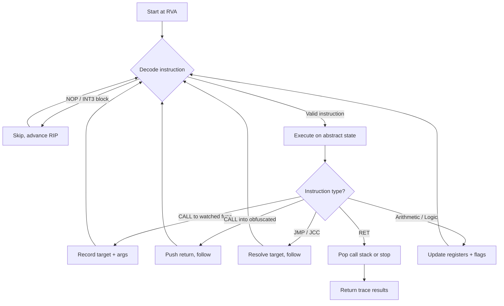
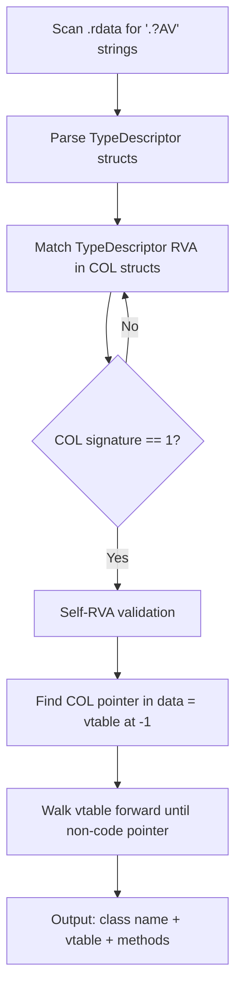
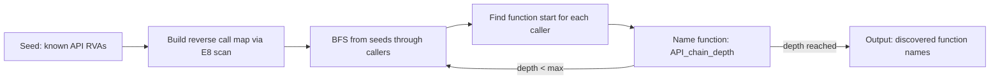

# Algorithms

## Static tracer

```mermaid
flowchart TD
    A[Start at RVA] --> B{Decode instruction}
    B -->|NOP / INT3 block| C[Skip, advance RIP]
    C --> B
    B -->|Valid instruction| D[Execute on abstract state]
    D --> E{Instruction type?}
    E -->|CALL to watched func| F[Record target + args]
    E -->|CALL into obfuscated| G[Push return, follow]
    E -->|JMP / JCC| H[Resolve target, follow]
    E -->|RET| I[Pop call stack or stop]
    E -->|Arithmetic / Logic| J[Update registers + flags]
    F --> B
    G --> B
    H --> B
    J --> B
    I --> K[Return trace results]
```

## RTTI recovery

```mermaid
flowchart TD
    A[Scan .rdata for '.?AV' strings] --> B[Parse TypeDescriptor structs]
    B --> C[Match TypeDescriptor RVA in COL structs]
    C --> D{COL signature == 1?}
    D -->|Yes| E[Self-RVA validation]
    D -->|No| C
    E --> F[Find COL pointer in data = vtable at -1]
    F --> G[Walk vtable forward until non-code pointer]
    G --> H[Output: class name + vtable + methods]
```

## Import chain BFS

```mermaid
flowchart LR
    A[Seed: known API RVAs] --> B[Build reverse call map via E8 scan]
    B --> C[BFS from seeds through callers]
    C --> D[Find function start for each caller]
    D --> E[Name function: API_chain_depth]
    E -->|depth < max| C
    E -->|depth reached| F[Output: discovered function names]
```
