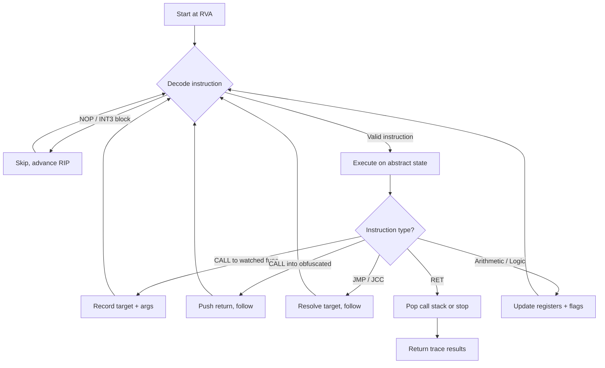
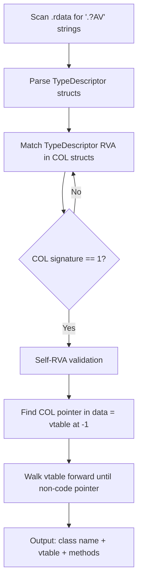
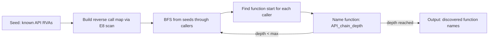

# libpefix

PE analysis toolkit for dumped and obfuscated x86-64 Windows binaries.

Built for reverse engineers working with memory dumps, packed executables, and protected binaries that need fixing before loading into IDA Pro or similar tools.

> This project was fully generated with AI assistance (Claude, Anthropic).

## Features

- **PE parsing** — load, modify, save PE64 files; RVA/offset conversion
- **Section recovery** — detect hidden code regions from gaps in the section table
- **RIP-relative scanning** — collect all RIP-relative memory references across executable sections
- **Synthetic exports** — generate an export directory so IDA auto-names functions at known RVAs
- **COFF symbols** — embed symbol entries directly into the PE (IDA reads `PointerToSymbolTable`)
- **RTTI parsing** — extract MSVC class names and vtable layouts from Complete Object Locators
- **Function naming** — infer names from error string references and known patterns
- **JMP chain flattening** — follow E9 chains and patch to the final target
- **Import chain BFS** — trace backward from known API addresses to discover callers
- **x86-64 decoder** — lightweight instruction decoder (subset) with IR representation
- **CFG builder** — construct control flow graphs from arbitrary entry points
- **Abstract interpreter** — emulate x86-64 with sparse memory model for constant propagation
- **Static tracer** — trace execution paths through obfuscated code, recording calls and arguments
- **EB FF patching** — NOP common anti-disassembly patterns

## Build

Requires Visual Studio 2017+ with C++ desktop workload.

```
build.bat
```

Output: `build\Release\libpefix.exe`

No external dependencies.

## Usage

```
libpefix.exe <input.exe> [options]
```

With no options, all safe fixups are applied (section recovery, EB FF patch, xref scan, RTTI, function naming).

| Option | Description |
|--------|-------------|
| `-o <path>` | Output file (default: `input_fixed.exe`) |
| `-b <hex>` | Override ImageBase (auto-detected from PE header if omitted) |
| `--all` | Apply all safe fixups |
| `--recover` | Recover hidden sections |
| `--patch-eb-ff` | NOP EB FF anti-disasm |
| `--xrefs` | Scan RIP-relative references |
| `--exports <file>` | Add exports from `name=RVA` file |
| `--coff <file>` | Embed COFF symbols from `name=RVA` file |
| `--trace <rva>` | Static trace from hex RVA |
| `--cfg <rva>` | Build and print CFG from hex RVA |
| `--dry-run` | Analyze only |
| `--verbose` | Detailed output |

## How it works

### Static tracer



### RTTI recovery



### Import chain BFS



## As a library

```cpp
#include <pefix/pefix.h>

pefix::PEFile pe;
pe.load("dump.exe");

auto refs = pefix::scanRipRelativeRefs(pe, pe.nt->OptionalHeader.ImageBase);
auto classes = pefix::parseRTTI(pe, pe.nt->OptionalHeader.ImageBase);
pefix::flattenJmpChains(pe);

pe.save("dump_fixed.exe");
```

## Project structure

```
include/pefix/          public headers
  pe.h                  PE64 file operations
  sections.h            section recovery
  xrefs.h              RIP-relative reference scanning
  exports.h            synthetic export table
  coffsyms.h           COFF symbol embedding
  analysis.h           RTTI, naming, JMP flatten, import chain
  x86_64/
    ir.h               instruction IR (registers, opcodes, values)
    disasm.h           subset x86-64 decoder + CFG builder
    emu.h              abstract interpreter
    trace.h            static execution tracer
  pefix.h              master include

src/                    implementation
tools/
  libpefix.cpp          CLI entry point
  cli.h                 colored console output
```

## License

MIT
